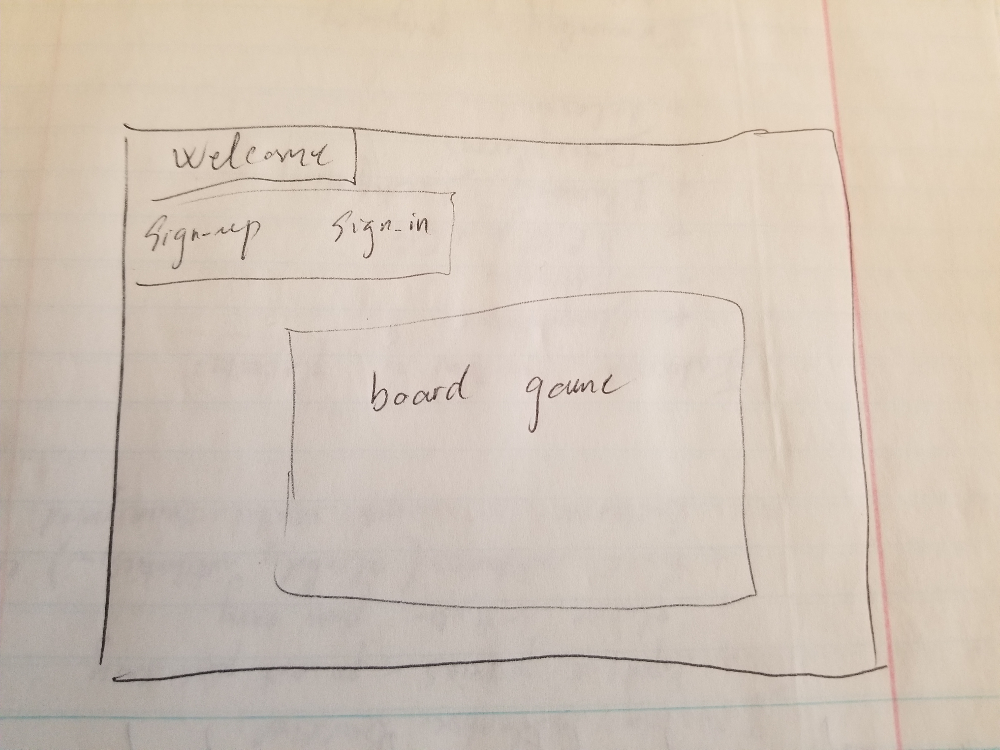

# First front-end project using JavaScript: Tic-tac-toe

Tic tac toe is an easy-to-play game; everyone knows how to play the game. As an inexperienced programmer, tic-tac-toe is a good first project.

## GitHub link:
https://github.com/TN-space/tictactoe-ThanhNguyen

## Planning

### User stories
As a user I want to have my own account.
As a user I want to be able to change my account password.
As a user I want to be able to start a game.
As a user I want to want to see how many games I had played.
As a user I want to be able to log out and have my game information saved.

### Technologies used
HTML/SCSS
jQuery/Ajax
JavaScript

### Improvement
Would like to add 2 more difficulty levels, each with bigger board game. The hardest level requires 5 in a row to win.

### Image

#### Wireframe

